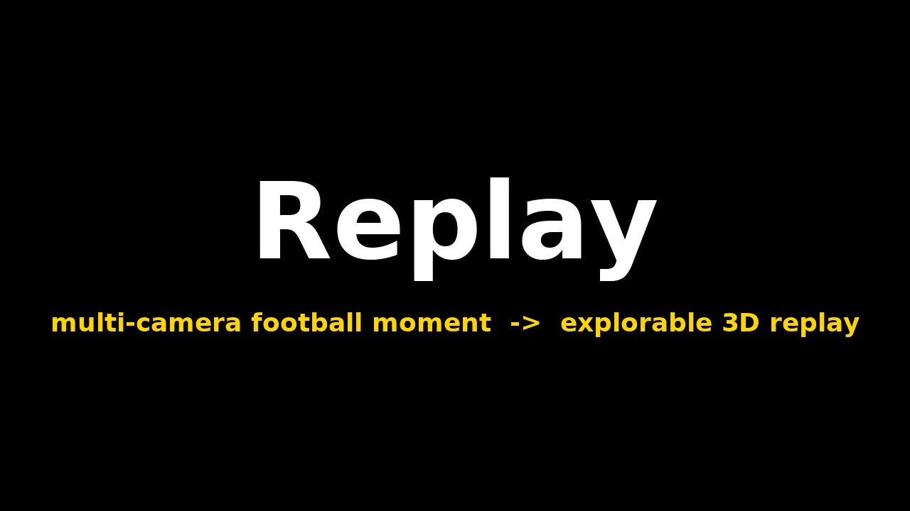
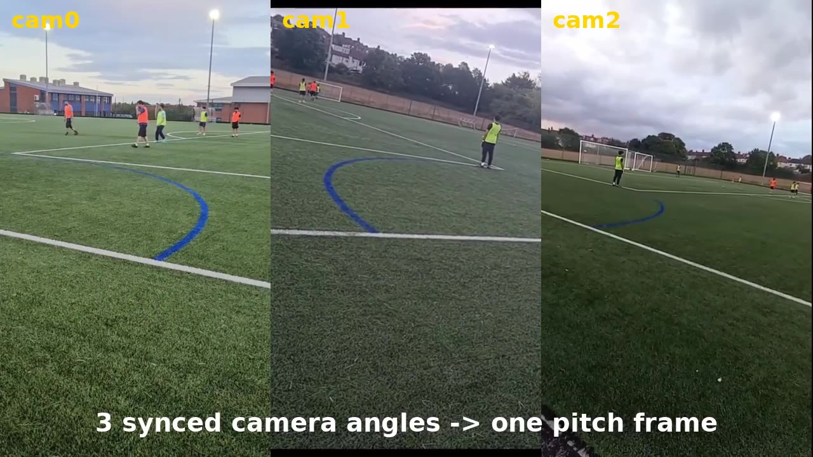
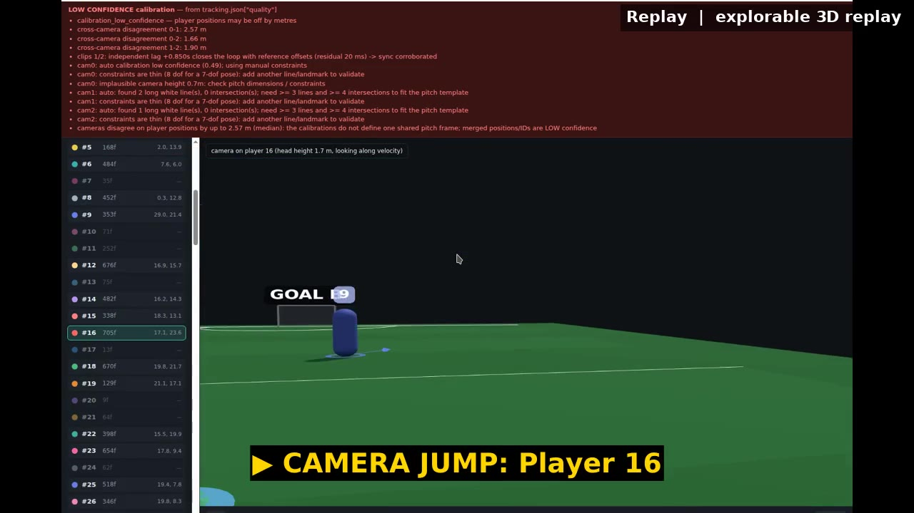
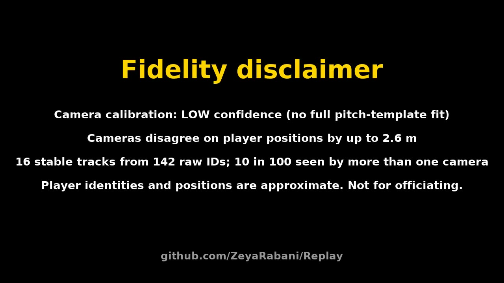

# demo/ — one-command demo video export

Turns a screen recording of the Stage 3 viewer + the N original camera clips
into `replay-demo.mp4` at the repo root:

| # | segment | length | source |
|---|---|---|---|
| 1 | title card "Replay" (black, white/yellow) | 3 s | ffmpeg `drawtext` |
| 2 | N-up of the original synced angles (`xstack`, generic N) | 6 s | the clips |
| 3 | the viewer recording, **caption burnt in at every camera jump** | as recorded | `jumps.json` sidecar (or WhisperX transcript of narration) |
| 4 | outro card — fidelity disclaimer built from `tracking.json["quality"]` | 5 s | ffmpeg `drawtext` |

 
 

## Setup (exact steps, also in `setup.sh`)

```bash
bash demo/setup.sh
```

which does:

1. `npx -y skills add veedstudio/open-edit --skill open-edit` → installs the agent skill to
   `.agents/skills/open-edit/SKILL.md` (1266 lines) + `scripts/preflight.sh`. The skill is driven by an
   agent through `npx --yes @veedstudio/openedit-cli {init,transcribe,prep,sample-style,generate-recipe,mux-audio}`;
   compositions are `.wv` documents (HTML + CSS, `animation-delay` is the timeline) rendered by `veed-engine-cli`.
2. `npx --yes @veedstudio/openedit-cli init --dry --workspace $PWD` — **on Linux this exits with
   `preflight: ERROR — unsupported platform linux/x64; rendering requires macOS arm64 or Windows x64`.**
   That is the verified reason the cut below is done by ffmpeg. `make_demo.py` still writes
   `replay-demo.wv.html` (an OpenEdit `.wv` composition with the same shots and jump cues) so a Mac can
   re-render the polished version with `veed-engine-cli <dir> --record`.
3. WhisperX, CPU only, in `.venv-whisperx/` (gitignored):
   ```bash
   python3 -m venv .venv-whisperx
   .venv-whisperx/bin/pip install -U pip
   .venv-whisperx/bin/pip install torch torchaudio --index-url https://download.pytorch.org/whl/cpu
   .venv-whisperx/bin/pip install whisperx      # whisperx 3.8.6 re-resolves torch 2.8.0 from PyPI; ~2 min, works on CPU
   ```
   Verified: `.venv-whisperx/bin/whisperx speech.wav --model tiny --compute_type int8 --device cpu --output_format json --output_dir out/`
   → `out/speech.json` with `segments[] {start,end,text,words[]}` (+ `word_segments[]`, omitted when no speech). ~7 s per 5 s of audio.
4. `pip install playwright` for the recorder (it attaches to an already-running Chrome over CDP, no browser download).

## The command the integrator runs

```bash
# 0. serve the viewer (branch devin/stage3-viewer) with the real tracking.json as its sample
cp out/tracking.json viewer/sample/tracking.json && (cd viewer && python -m http.server 8765 &)

# 1. record 30 s of the viewer and write jumps.json (Chrome must be running with --remote-debugging-port=29229)
python demo/record_viewer.py --url http://localhost:8765/ --out demo/out/rec.mp4 --seconds 30

# 2. cut the demo
python demo/make_demo.py \
  --recording demo/out/rec.mp4 --jumps demo/out/jumps.json \
  --clips out/synced/cam0.mp4 out/synced/cam1.mp4 out/synced/cam2.mp4 \
  --tracking out/tracking.json \
  --crop 1600:1040:0:85 \
  --out replay-demo.mp4
```

* `--clips` takes any N (1 → full frame, 2–4 → 2 columns, 3 → 3 columns, 5+ → 3 columns).
* `--crop w:h:x:y` trims browser chrome from a full-screen capture (values above are for a 1600x1200 display, maximised Chrome).
* `--narration voice.wav` muxes narration under the recording; if no `--jumps` is given the narration is
  transcribed with WhisperX and the segments become the captions.
* Outputs: `replay-demo.mp4`, `replay-demo.wv.html` (OpenEdit composition), `replay-demo.shots.json` (shot list + captions).
* Runtime: ~6 s for a 30 s recording on 4 CPU cores.

### jumps.json

Written by `record_viewer.py`; the viewer/any recorder can write the same thing:

```json
{"recording": "rec.mp4",
 "jumps": [{"t": 1.05, "target": "orbit",     "label": "Overview (orbit)"},
           {"t": 4.41, "target": "player:16", "label": "Player 16"},
           {"t": 12.56, "target": "anchor:behind_A", "label": "Behind A"}]}
```

`t` is seconds into the recording. A plain list of `{t, label}` also works; `target: "player:N"` is
expanded to "Player N" when no label is given.

## Honest status

* Real MP4 produced on Linux with today's 3 clips and a 30 s capture of the Stage 3 viewer (44 s total, 8 captions).
* VEED OpenEdit: installed and inspected, **not** used for the render — its engine refuses Linux (see step 2).
  The `.wv` composition is emitted but has not been rendered on a Mac, so treat it as a starting point for the
  open-edit agent, not a verified deliverable.
* WhisperX path is installed and verified on a sample speech clip; the shipped demo has no narration, so the
  captions in `replay-demo.mp4` come from `jumps.json`.
* The recording captures the whole screen (x11grab); the browser's quality banner is visible on purpose.
