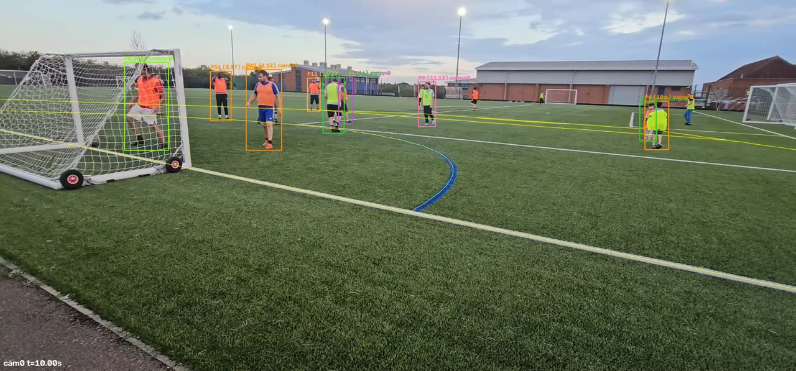
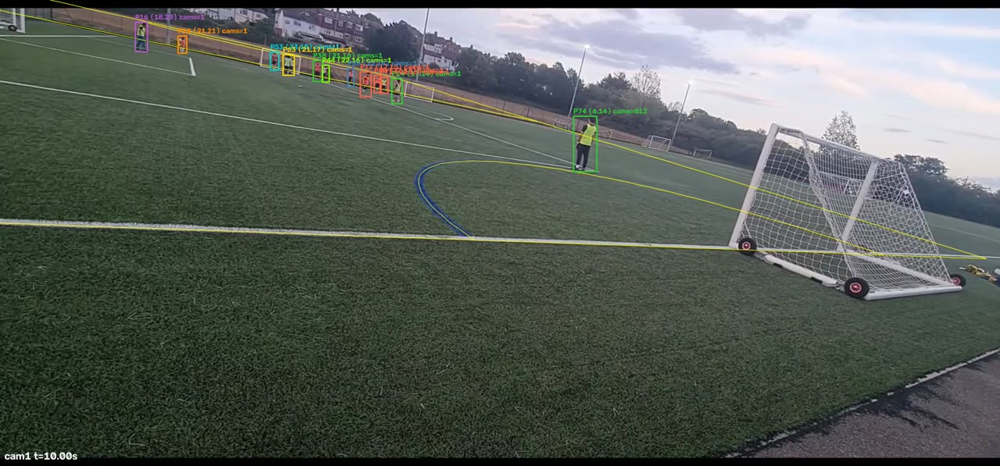
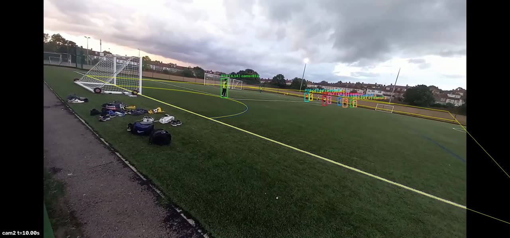
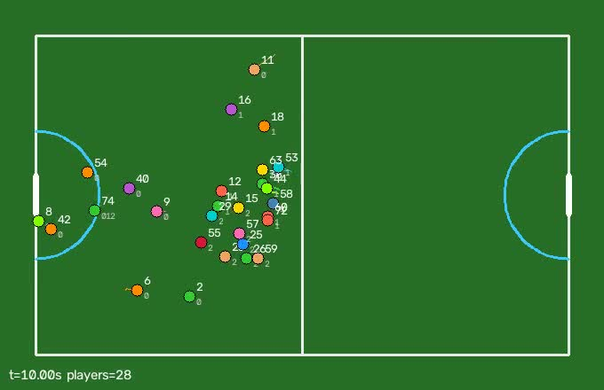

# Stage 1 results on the real footage (2026-09-12)

Three phone clips of one small-sided 5-a-side moment, filmed from behind/beside the
same goal (cam0 = right of goal, low; cam1 = left touchline; cam2 = right corner).
Pitch model: `examples/pitch_small_sided_50x30.json` (50 x 30 m, D radius 6 m — a
**guess**, the pitch was not measured). Output: `examples/real_footage/tracking.json`.

Everything below is measured by the pipeline itself and stated as-is. The headline:
**sync is good, per-camera line fits are good, but the three cameras do not agree on
a single pitch frame (median disagreement 1.7–2.6 m), so merged positions and IDs are
low confidence.** `quality.calibration_low_confidence` is `true` in the output.

## How this run was produced

```
examples/real_footage/reproduce.sh      # wraps: pitchworld run ... --offsets 0 0 0 --reuse
```

* Input clips: the already-synced `cam0/1/2.mp4` (2316x1080 @ 30 fps, 721 frames, 24.05 s)
  produced by the first Stage 1 run, hence `--offsets 0 0 0`.
* Detections: Modal credentials were not available in this session, so the per-camera
  YOLOv8m + ByteTrack detections were **rebuilt from the previous `tracking.json`**
  (`examples/real_footage/debug/raw_tracks.json`, 7059 / 8739 / 6393 person boxes on
  cam0/1/2 = 9.8 / 12.1 / 8.9 per frame) and only projection, fusion and the new
  post-processing (static-object filter, smoothing, team colours, ID-stability metrics)
  were re-run. Consequence: boxes the first fuse step already discarded (outside the
  pitch margin, box height < 12 px) are not recoverable, and there is **no ball** track
  (ball detection needs a fresh YOLO pass with `--ball`).

## Numbers

### Sync (from the first run, on the raw phone clips)

| clip | offset (s) | confidence | method |
|---|---|---|---|
| cam0 | 0.000 | 1.00 | reference |
| cam1 | -0.480 | 0.95 | audio x-corr |
| cam2 | +0.350 | 0.95 | audio x-corr |

Loop closure cam1→cam2 measured independently: +0.850 s vs 0.830 s implied, residual
20 ms (< 1 frame). `sync_low_confidence = false`. Contact sheet: `debug/sync_check.jpg`.

### Per-camera calibration (manual traced goal line + D arc + far parallel line, pose fit)

| cam | method | traced px | reproj err | confidence | notes |
|---|---|---|---|---|---|
| cam0 | manual_pose | 150 | 0.8 px / 0.01 m | **0.30** (low) | thin constraints (8 dof for 7-dof pose); fitted camera height 0.7 m is implausible |
| cam1 | manual_pose | 137 | 0.7 px / 0.01 m | 0.60 | thin constraints |
| cam2 | manual_pose | 93 | 0.5 px / 0.02 m | 0.60 | thin constraints |

Automatic line detection found only 1–2 long white lines per camera (need ≥ 3 lines /
4 intersections), so all three cameras are on manually traced geometry. The fits
reproduce the traced lines almost perfectly, which says nothing about the unobserved
directions: each camera only sees one goal line, one D and one further parallel line.

### Cross-camera consistency (median distance between the same player seen by two cameras)

| pair | median disagreement |
|---|---|
| cam0–cam1 | **2.57 m** |
| cam0–cam2 | 1.66 m |
| cam1–cam2 | 1.90 m |

Anything above 1 m trips the low-confidence flag. Only **9.5 %** of fused player
observations are supported by ≥ 2 cameras: the 2 m `--merge-dist` gate is smaller than
the calibration disagreement, so the same person mostly becomes 2–3 separate IDs.

### Fusion / ID statistics

| metric | previous tracking.json | this run |
|---|---|---|
| unique IDs (24 s, ~14 people on/around the pitch) | 142 | **102** |
| mean players per frame | 27.7 | 29.0 |
| IDs seen in > 50 % of frames | 16 | 18 |
| IDs seen in > 80 % of frames | – | 7 |
| estimated ID switches | – | 10 (25 / min) |
| fragmentation (tracks per true trajectory, est.) | – | 3.52 |
| mean track length | – | 205 frames (6.8 s) |
| tracks shorter than 15 frames | – | 0 (dropped by `--min-track-frames 15`) |
| static (non-player) IDs dropped | – | 0 (already removed upstream) |

~29 "players" per frame for a 5-a-side game is the visible symptom of the calibration
disagreement: roughly 2x duplication, plus spectators / children by the goal that survive
the 3 m pitch margin.

### Team colours

Jersey-colour clustering on the synced frames: team 0 (orange bibs) 27 IDs, team 1 (yellow
bibs) 15 IDs, 59 IDs left as `role: "unknown"` (too few / too small samples, mostly the
duplicate and edge tracks). Colours (BGR): `[84,101,208]` orange, `[89,179,170]` yellow.
See `debug/teams_pitch.png`, `debug/jerseys_cam0.jpg`.

### Joint refinement (`--joint-refine`) — tried, rejected

Jointly re-fitting the three poses using shared players drives the reported disagreement
to 0.17–0.42 m, but it does so by degenerating: focal length pins at the 6948 px bound,
the D radius collapses from 6 m to 1.5 m, and all player positions end up inside a
2 x 3 m patch. It is not used for the shipped `tracking.json`. Branch
`devin/1789226610-jointfit-robust` is working on this separately.

## Frame grabs (t = 10 s and 20 s, all from `examples/real_footage/debug/`)

Yellow = projected pitch grid through each camera's calibration; boxes = fused IDs with
pitch coordinates in metres.






More: `overlay_cam*_t20.jpg`, `calib_cam*.jpg` (traced geometry vs. fitted lines),
`sync_check.jpg`, `teams_pitch.png`.

## What Stages 2–4 should assume

* Use `frames[].players[].x/y` (metres, pitch frame of `pitch`), `vx/vy/speed`
  (smoothed), `team` (0/1) and `role` (`player` | `unknown`).
* Expect duplicate IDs for the same person (~2x). Prefer IDs listed in
  `quality.teams.id_to_team` and with long lifetimes; the 7 IDs present in > 80 % of
  frames are the safest camera anchors.
* Absolute positions are good to ~2 m; relative motion within one camera's tracks is
  much smoother than that.
* Show the honesty banner: `quality.calibration_low_confidence == true`.

## How to actually fix it (not done today)

1. Trace one more independent feature per camera (the far goal line / touchline / centre
   line) — the pose fit is currently under-constrained (8 dof for 7).
2. Measure the pitch; 50 x 30 m and a 6 m D are guesses.
3. Re-run detection with `--ball` on Modal for a ball track.
